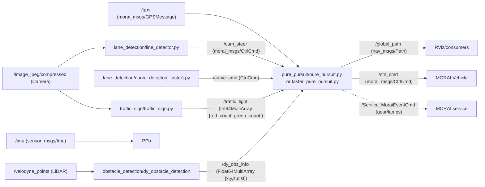

### What this is
A ROS1 project for the MORAI simulator that fuses:
- camera lane/curve detection,
- global-path following with pure pursuit and mission logic,
- LiDAR DBSCAN clustering for dynamic obstacles,
- camera traffic light detection,
- path recording utilities.

Launch everything (faster variant per README) with:
- `roslaunch pure_pursuit faster_pure_pursuit.launch`

---

## System architecture



---

## Packages and files

### 1) lane_detection
Camera-based lane center and curve detection; used as steering assist.

- Files
  - `src/line_detector.py`
    - Subscribes: `'/image_jpeg/compressed'`, `'/gps'`, `'/imu'`, `'/waypoint'`, `'/mission'`
    - Steps: HSV threshold (white lanes) → blur/threshold → BEV warp (`Warper`) → slide-window lane finder (`SlideWindow`) → compute center x → PID-like steering
    - Publishes: `'/cam_steer' (CtrlCmd)` with velocity and steering for assist driving
    - Notes: Slows down when off-center or at high yaw; uses camera steering heavily when GPS is “dark” (lat/lon ≤ 1)
  - `src/curve_detector.py` and `src/curve_detector_faster.py`
    - Detects turn/curve lines via color threshold + Canny + Hough; BEV warp; custom slide window for curve; outputs `'/curve_cmd' (CtrlCmd)` with a dedicated motor/steering for right-angle/S curves
    - Gating logic: only active in GPS shadow zones until mission is done
  - `src/slide_window.py`, `src/slide_window_faster.py`
    - Sliding window lane tracker on BEV images; returns an estimated lane-center x location and “which lane line is visible” state
    - Faster version tweaks ROIs and thresholds for performance/aggressiveness
  - `src/curve_slide_window_faster.py`
    - Sliding window tailored for curve detection; uses steering/yaw and “turn_left” state machine to pick windows and compute center
  - `src/warper.py`
    - Fixed perspective transform `M` for BEV and `Minv` for unwarp
    - Note: `unwarp` calls `cv2.warpPersective` (typo) but is unused

- Launch
  - `launch/lane_detection.launch`: starts `line_detector.py`
  - `launch/curve_detection.launch` and `launch/curve_detection_faster.launch`: start curve detectors
  - `launch/lane_detection_faster.launch`: used in faster stack (included by `faster_pure_pursuit.launch`)

- Core behavior
  - Lane mode: compute `error = 320 - x_center`, steering = `k * error` with slow/fast gains
  - Curve mode: detect line angle in a small ROI; compute steering from angle and yaw sign; manage turn state (left/right) to recover lane

---

### 2) pure_pursuit
Central controller and mission manager. Loads paths, computes pure pursuit steering, fuses camera outputs, enforces mission behaviors.

- Files
  - `src/pure_pursuit.py` (baseline) and `src/faster_pure_pursuit.py` (competition-tuned)
    - Publishes: `'/ctrl_cmd' (CtrlCmd)`, `'/global_path' (Path)`, `'/mission' (Bool)`, `'/waypoint' (Int64)`
    - Subscribes: `'/gps'`, `'/imu'`, `'/traffic_light' (Int64MultiArray)`, `'/cam_steer' (CtrlCmd)`, `'/curve_cmd' (CtrlCmd)`, `'/dy_obs_info' (Float64MultiArray)`
    - Services: `/Service_MoraiEventCmd` for gear/turn signals/emergency/parking
    - Positioning: converts lat/lon to UTM using `pyproj` and publishes TF `map -> base_link`
    - Path IO: loads `path_maker/path/*.txt` via `utils.pathReader`, publishes as `'/global_path'`, and slices a `local_path`
    - Control: computes steering via `utils.purePursuit` forward/rear kinematics; outputs velocity/steering/brake to `/ctrl_cmd`
    - Camera integration: uses `/cam_steer` and `/curve_cmd` during GPS dark zones and special segments (e.g., S-curve)
    - Dynamic obstacles: brakes/emergency if nearest obstacle within x<7m and |y| within threshold based on `/dy_obs_info`
    - Traffic lights: simple logic using “green_count - red_count” from `/traffic_light`
  - `src/utils.py`
    - `pathReader`: load `path_maker/path/<name>.txt` into `nav_msgs/Path`
    - `findLocalPath`: nearest waypoint + window slice to produce a local path
    - `purePursuit`: forward and rear steering functions; returns steering angle in degrees
    - `velocityPlanning`: computes a curvature-based speed profile (not heavily used in current scripts)
  - `src/GPSIMUParser.py`
    - Optional node to convert `/gps` + `/imu` into `/odom` using UTM; publishes TF and Odometry

- Launch
  - `launch/pure_pursuit.launch`
    - Starts `pure_pursuit.py`, includes `traffic_sign`, `lane_detection`, `curve_detection`, and `obstacle_detection` launches
  - `launch/faster_pure_pursuit.launch`
    - Starts `faster_pure_pursuit.py`, includes the “faster” lane/curve detection and obstacle detection
  - `launch/test_drive.launch`
    - Starts `get_yaw_from_imu.py` and `pure_pursuit.py` with traffic and lane/curve nodes

- Mission logic (key ranges; faster variant often uses more aggressive speeds)
  - Start: low-speed/large LFD, left signal on early waypoints
  - Uphill stop: stop and hold for a few seconds (e.g., 3.3–4 seconds)
  - Right-angle curve: intake `'/curve_cmd'`, reduced speed, manage lane recovery after turn
  - S-curve: in GPS shadow, rely on `'/cam_steer'`, aggressive slowdowns and amplified steering around yaw windows
  - T-parking: path switching sequence `first(_faster)` → `parking_1` → `parking_2` (brake + reverse) → `parking_3` → `parking_4` (brake + forward) → `second(_faster)`
  - Acceleration zone: sustained high-speed segment with controlled LFD and temporary braking at end
  - Finish: right signal, brake to stop, parking service

---

### 3) obstacle_detection
LiDAR clustering via DBSCAN with KD-tree and dynamic reconfigure.

- Files
  - `src/dy_obstacle_detection.cpp`
    - Subscribes: `'/velodyne_points'`
    - Pipeline:
      - PassThrough filters by ROI (x/y/z)
      - DBSCAN KD-tree clustering (configurable epsilon, minPoints, cluster size)
      - For each cluster: compute min/max, size, center, distance
      - Filter by bounding box physical sizes
      - Create RViz `MarkerArray` CUBEs and choose the nearest cluster
      - Publish nearest as `Float64MultiArray [x,y,z,distance]`
    - Publishes:
      - `'/obs_cluster'` clustered cloud
      - `'/obs_marker'` bounding boxes (MarkerArray)
      - `'/obs_position'` nearest bounding box center
      - `'/obs_cropbox'` cropped cloud after ROI
      - `'/dy_obs_info'` [x,y,z,dist] for controller logic
    - Dynamic params: `cfg/hyper_parameter.cfg` controls ROI, epsilon, minPoints, cluster size, bounding-box ranges
  - `src/dbscan.h`, `src/header.h`: clustering and common includes

- Launch
  - `launch/dy_obstacle_detection.launch`
    - Includes Velodyne driver `velodyne_pointcloud/32e_points.launch`, starts `dy_obstacle_detection`

---

### 4) traffic_sign
Simple HSV-based red/green light detection from camera.

- Files
  - `src/traffic_sign.py`
    - Subscribes: `'/image_jpeg/compressed'`
    - Crops ROI, HSV masks for red and green, counts pixels
    - Publishes: `'/traffic_light' (Int64MultiArray [red_count, green_count])`
    - Current logic: if `green_count >= 550` → treat as green; else red. Tune thresholds per camera/lighting

- Launch
  - `launch/traffic_sign.launch`

---

### 5) path_maker
Record GPS trace files the controller will follow.

- Files
  - `src/path_maker.py`
    - Args: `<folder> <name>`; creates `path_maker/path/<name>.txt`
    - Subscribes: `'/gps'`; writes `(lat, lon, alt, mode)` whenever movement exceeds a small distance threshold
  - `src/path_maker_utmk.py`, `src/utmk_to_odom.py`: helpers for coordinate conversions (not required for basic run)

- Launch
  - `launch/path_maker.launch`: record paths interactively

---

## Topics and messages (common ones)

- Inputs
  - `'/image_jpeg/compressed' (sensor_msgs/CompressedImage)`: camera for lane/traffic
  - `'/velodyne_points' (sensor_msgs/PointCloud2)`: LiDAR for obstacles
  - `'/gps' (morai_msgs/GPSMessage)'`, `'/imu' (sensor_msgs/Imu)`: localization

- Inter-node
  - `'/cam_steer' (morai_msgs/CtrlCmd)`: lane assist steering from camera
  - `'/curve_cmd' (morai_msgs/CtrlCmd)`: special curve assist steering
  - `'/traffic_light' (std_msgs/Int64MultiArray)`: [red_count, green_count]
  - `'/dy_obs_info' (std_msgs/Float64MultiArray)`: nearest obstacle [x,y,z,distance]
  - `'/global_path' (nav_msgs/Path)`: path for visualization/tools
  - `'/mission' (std_msgs/Bool)`, `'/waypoint' (std_msgs/Int64)`: mission and progress flags

- Outputs to simulator
  - `'/ctrl_cmd' (morai_msgs/CtrlCmd)`: final vehicle command from controller
  - `/Service_MoraiEventCmd (morai_msgs/MoraiEventCmdSrv)`: gear/turn/emergency/parking

---

## Launch flows

- Full faster stack (per README)
  - `roslaunch pure_pursuit faster_pure_pursuit.launch` [[memory:5998702]]
    - Starts `faster_pure_pursuit.py`
    - Includes `traffic_sign`, `lane_detection_faster`, `curve_detection_faster`, and `dy_obstacle_detection`
- Baseline stack
  - `roslaunch pure_pursuit pure_pursuit.launch` [[memory:5998702]]
    - Starts `pure_pursuit.py`, includes base `lane_detection`, `curve_detection`, `traffic_sign`, and `dy_obstacle_detection`
- Record a path
  - `rosrun path_maker path_maker.py path <file_basename>` [[memory:5998702]]

---

## Key file excerpts

- `pure_pursuit/launch/pure_pursuit.launch` includes all perception/control nodes:
```1:14:pure_pursuit/launch/pure_pursuit.launch
<?xml version="1.0" encoding="UTF-8"?>
<launch>
    <!-- <node pkg="pure_pursuit" type="get_yaw_from_imu.py" name="get_yaw_from_imu"/> -->
    <node pkg="pure_pursuit" type="pure_pursuit.py" name="pure_pursuit" output="screen"/>

    <!-- 차선 및 충돌 기록 -->
    <!-- <node pkg="pure_pursuit" type="scoring.py" name="scoring" output="screen"/> -->


    <include file="$(find traffic_sign)/launch/traffic_sign.launch" />
    <include file="$(find lane_detection)/launch/lane_detection.launch" />
    <include file="$(find lane_detection)/launch/curve_detection.launch" />
    <include file="$(find obstacle_detection)/launch/dy_obstacle_detection.launch" />
</launch>
```

- `obstacle_detection/src/dy_obstacle_detection.cpp` publishes nearest obstacle info:
```197:206:obstacle_detection/src/dy_obstacle_detection.cpp
        obstacle.emplace_back(BoxArray.markers[i].pose.position.z);
        obstacle.emplace_back(distance);
        obstacle_vec.emplace_back(obstacle);
      } 
      
      sort(obstacle_vec.begin(), obstacle_vec.end());

      ObsInfo.data[0] = obstacle_vec[0][0];
      ObsInfo.data[1] = obstacle_vec[0][1];
      ObsInfo.data[2] = obstacle_vec[0][2];
      ObsInfo.data[3] = obstacle_vec[0][3];
```

---

## Tuning and gotchas

- Lane thresholds: `line_detector.py` uses HSV thresholds geared for white lanes; adjust for your camera/track.
- Curve logic: `curve_detector(_faster).py` uses a small ROI + Hough; tuning ROIs and length thresholds affects turn detection and timing.
- Warper typo: `warper.py` has a typo `warpPersective` in `unwarp`; function is unused, safe to ignore.
- Traffic light: simplistic color-count logic (`green_count >= 550` → green), likely needs adjusting for exposure/ROI.
- Dynamic obstacle: all logic depends on DBSCAN params + bounding-box filters; start by tuning `cfg/hyper_parameter.cfg` via dynamic reconfigure.
- Missions by waypoint: waypoint index windows are scenario-specific to your path files (e.g., `first`, `first_faster`, `second_faster`, `parking_*`). If you regenerate paths, revisit these ranges.

---

## How to extend

- Add new missions: branch in `pure_pursuit.py` by waypoint ranges; use `setMotorMsgWithVel`, `setServoMsgWithLfd`, and camera/LiDAR signals.
- Change global route: record with `path_maker.py`, place under `path_maker/path/`, then set `self.path_name` in controller.
- Improve perception: replace HSV rules with ML models (e.g., segmentation or sign detection), but keep publishing the same topics to stay compatible.

---

- I reviewed core nodes/launches across all packages, mapped topics/services, and summarized file roles and mission logic, including faster variants and their launch wiring.